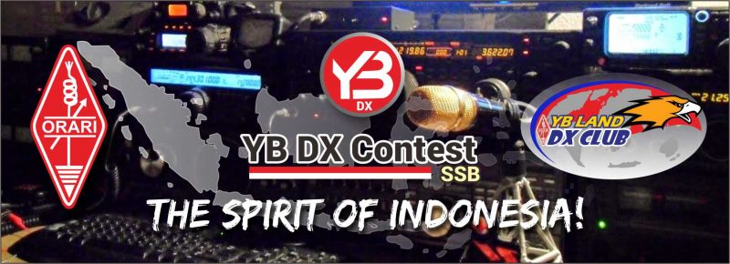

# YB DX Contest Robot


**YB DX Contest Robot** adalah sebuah *platform* web aplikasi interaktif dan otonom (sistem juri otomatis) yang dirancang khusus untuk memfasilitasi penerimaan, pengolahan, dan ajudikasi (penjurian) log data komunikasi (QSO) amatir radio dalam format standar internasional **Cabrillo**. 

Aplikasi ini dibangun murni menggunakan **Vanilla PHP (PDO)**, **Vanilla CSS (Glassmorphism & Dark Mode)**, dan **MySQL**, tanpa menggunakan *framework* pihak ketiga yang berat (seperti Laravel, React, Tailwind, dll). Arsitektur minimalis ini menjamin kecepatan eksekusi yang luar biasa kencang, aman, dan sangat mudah untuk dimigrasikan ke segala jenis peladen web (*web server*).

---

## 🚀 Fitur Utama

1. **Mesin Parser Cabrillo Super Pintar**
   - Mendukung berkas Cabrillo v2 dan v3.
   - Pengecekan atribut *header* otomatis (mendeteksi apabila format `CATEGORY-OPERATOR` dan data *callsign* operator kurang lengkap).
   - Pengonversian V2 ke V3 secara *on-the-fly* menggunakan antarmuka koreksi interaktif di web.
2. **Validasi Modus SSB & Rentang Waktu**
   - Menghalau baris `QSO:` yang bukan merupakan mode *Single Side Band* (SSB / `PH`).
   - Penolakan baris QSO yang waktu kejadiannya meleset dari jadwal kontes (Setiap Sabtu Minggu Ke-2 Bulan Januari selama 24 jam penuh UTC).
   - Penandaan otomatis sebagai `X-QSO` bagi baris data yang melanggar aturan, tanpa merusak keseluruhan fail log peserta.
3. **The Cross-Checker Engine (Mesin Ajudikasi Silang)**
   - Secara masif membaca ratusan ribu baris `QSO:` dari seluruh kontestan yang berpartisipasi dan menyilangkannya dengan batas deviasi waktu **30 menit**.
   - Mengelompokkan status silang (*cross-reference*) menjadi: `VALID` (Cocok), `BUSTED` (Data *exchange* keliru), `NIL` (Lawan tidak mencatat, atau beda *band/mode*, atau beda waktu > 30 menit), `DUPE` (Log ganda), dan `UNIQUE` (Stasiun lawan dicatat oleh kurang dari 3 partisipan). Hanya QSO **VALID** yang akan dihitung Poin dan Multiplier-nya.
   - Mengeluarkan dokumen teks murni berupa Laporan **UBN (Unique, Busted, NIL)** yang memuat status setiap baris QSO secara detail.
4. **Papan Peringkat Berlapis Ketat (*Leaderboard*)**
   - Klasemen hasil murni maupun hasil ajudikasi (*Final Score*) disajikan secara ketat dan berjenjang dari `Kategori Operator -> Band -> Power -> Benua -> Negara`.
   - Papan rekor sepanjang masa (All-Time High / ATH) merekam para jawara tak tertandingi di setiap kategori selama sejarah kontes.
5. **Keamanan Ekstra (Sistem PIN)**
   - Penerbitan PIN 6-digit secara acak yang dikirimkan via SMTP untuk setiap peserta yang pertama kali mengunggah.
   - PIN berfungsi sebagai otentikasi lapis dua untuk memperbaharui/menimpa log dan mengintip detail kesalahan data pada saat ajudikasi belum diumumkan. (PIN akan di-*reset* saat kontes selesai dan masuk fase adjudikasi final).
6. **Generator Sertifikat Elektronik (e-Certificate)**
   - Didukung oleh pustaka `mPDF`, aplikasi merakit Sertifikat PDF interaktif berisikan nama, kategori, serta total poin, langsung diunduh ke ponsel/komputer peserta tanpa membebani penyimpanan peladen terlalu lama. Latar belakang piagam dapat ditukar kapan saja secara *real-time* oleh Manajer.
7. **Bilingual (ID/EN) & Panel Admin God-Mode**
   - Transisi mulus antara Bahasa Indonesia dan Inggris.
   - Panel Manajer (Admin) untuk Diskualifikasi partisipan, Konfigurasi *Emailer* SMTP, CRUD Pengurus (*Committee*), dan pengelolaan Hadiah Plakat.

---

## ⚙️ Persyaratan Sistem (*System Requirements*)

- **Sistem Operasi**: Windows, Linux, atau macOS (bisa dijalankan via *Localhost* XAMPP/WAMP/LAMP).
- **Web Server**: Apache atau Nginx.
- **PHP**: Versi 7.4 ke atas (Direkomendasikan **PHP 8.x**).
    - Ekstensi `pdo_mysql` (Untuk koneksi *Database* PDO).
    - Ekstensi `mbstring`, `gd` (Diperlukan oleh `mPDF` untuk memanipulasi teks PDF & gambar).
- **Database**: MySQL 5.7+ atau MariaDB 10.3+.
- **Composer**: Terinstal secara global pada komputer server (Untuk menarik *dependency* mPDF dan PHPMailer).

---

## 🛠 Panduan Instalasi & Persiapan Server

### 1. Kloning / Unduh Repositori
Tempatkan *folder* aplikasi (`YBDXContest`) ke dalam direktori publik *Web Server* Anda (contoh: `C:\xampp\htdocs\YBDXContest` atau `/var/www/html/YBDXContest`).

### 2. Membangun Basis Data (MySQL)
Sistem memiliki skrip DDL otomatis yang akan mengatur tabel untuk Anda:
1. Buka terminal (*Command Prompt / Bash*).
2. Arahkan *path* masuk ke direktori folder proyek Anda:
   `cd c:\xampp\htdocs\YBDXContest`
3. Jalankan skrip *setup* PHP bawaan (Pastikan layanan MySQL di XAMPP/Panel sedang berjalan):
   `php setup_database.php`
4. Selamat! *Database* `ybdxcontest` berserta seluruh relasi tabel intinya (`participants`, `cabrillo_logs`, `qsos`, `users`, dll) telah terbentuk otomatis.

### 3. Mengunduh Dependensi Eksternal (Composer)
Buka terminal pada direktori akar aplikasi `YBDXContest`, lalu jalankan:
```bash
composer require mpdf/mpdf
composer require phpmailer/phpmailer
```
Ini akan menciptakan folder `vendor/` berisikan roda penggerak *E-Certificate* dan surat menyurat SMTP kita.

### 4. Konfigurasi Dasar
Secara bawaan, aplikasi berjalan di `localhost` (127.0.0.1) tanpa *password* dengan *user* `root` (Bawaan XAMPP).
Jika Anda memigrasikan ini ke cPanel / peladen publik, pastikan mengubah kredensial koneksinya di dalam berkas:
📄 `config.php`
Ubah *variabel*: `$host`, `$dbname`, `$user`, dan `$pass`.

---

## 🕹 Cara Penggunaan (*Workflow*)

**A. Sisi Peserta (Peserta Radio Amatir / Contester)**
1. **Submit Log**: Kunjungi portal web, pilih *Upload Cabrillo Log*. Peserta memasukkan berkas `.log`.
2. **Interactive Fix**: Bila file adalah Cabrillo V2, akan muncul form pop-up meminta peserta melengkapi *header* wajib V3.
3. **PIN Issued**: Usai berhasil ditekan, sistem menembakkan PIN rahasia ke Email (atau jika di tahap pengembangan lokal/tanpa SMTP, PIN bisa dicek di dalam log DB). 
4. **Resubmission**: Peserta wajib menggunakan PIN tersebut jika mereka mengunggah ulang file revisi dalam masa kontes.

**B. Sisi Manajer (Kepanitiaan)**
1. Masuk ke halaman `http://[domainanda]/admin/login.php`.
2. Gunakan kredensial *default*: Username `admin`, Password `admin123` (harap segera ubah rahasia/sandi *hash* ini).
3. **Menu Adjudicate**: Klik menu *Run Adjudication* di sisi pinggir Dasbor, kemudian klik tombol besarnya. Hitungan milidetik, seluruh ratusan log di *database* dibenturkan dan dirilis status Final-nya. 

---

## 🔒 Struktur Keamanan
- **Prepared Statements (PDO)**: Tak ada celah *SQL Injection*. Seluruh kueri interaktif ke MySQL telah dipasangkan gembok injeksi melalui ikatan parameter PDO ketat (`$pdo->prepare()`).
- **XSS Sanitization**: Seluruh `echo` yang memanggil data luaran pengguna (terutama dari `SOAPBOX:`) dibungkus oleh fungsi `htmlspecialchars()` murni, melumpuhkan sisipan skrip nakal.
- **Isolasi Log**: Berkas `.log` mentah Cabrillo tidak akan pernah disimpan dengan ekstensi bisa eksekusi (`.php`). Semuanya disimpan dan dibaca secara *Plain-Text* dari sub-direktori internal, menutup kebocoran *Remote Code Execution*.

---

### *Developer Notes*
Dirancang dan dibangun oleh **Robby Sandes - YB4HQ**. *73 and Good DX!*
